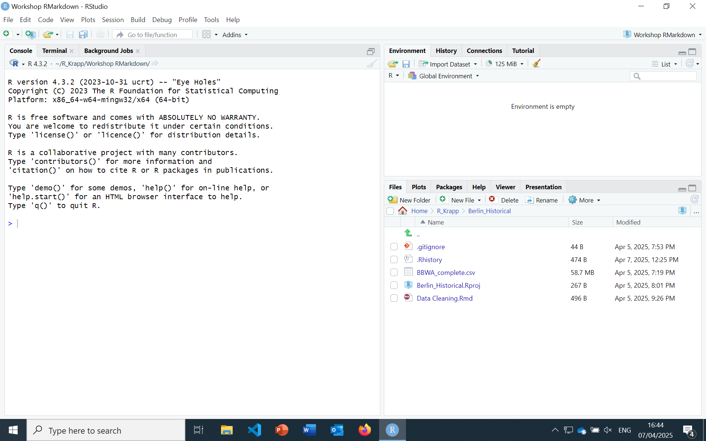

```{r setup, include=FALSE}
# fig.pos = 'H' defines that figures in the document should appear where the code to create them is run.
knitr::opts_chunk$set(echo = TRUE, fig.pos='H')
library(tidyverse)
library(knitr)
library(fixest)
```

## This is an example research document:

We will load some data, perform an analysis, visualize the results and compile it all into a nice document.

Markdown is a simpler language for creating text documents than Latex.
For example, to let text appear in a new line, leave a line blank:

As you can see, this text appears in a new line.
To make a list, simply number your points: For our analysis, we will:

1.  Get some data.

2.  Clean it up.

3.  Create some summary statistics

4.  Run a regression

5.  Visualize the result

Or create a list with dots.
We will use R Markdown to create PDF documents today, but R Markdown can generate a wide range of formats, including:

-   HTML Websites

-   Word Documents

-   PowerPoint Presentations.

It also has a Visual editor: If you have an R Markdown file open, click on 'Visual' in the upper left area to open it.
It makes things like adding an image or a citation easier.
Below is an example image I inserted using the visual editor:



This file can also include Latex code you'd like to use.
For equations, Latex is typically used: $y = x\beta + \epsilon$.

One can create sub-headers by using hash signs: One hash is used for the header of the document, two for the headers of chapters, three for sub-headers of the chapters and so on.
(We already have a title field in the YAML header above, so we typically only use two or more hashes).

### This is an example sub-header.

A major strength of R Markdown is the combination of text and code: The text below alternates with R-Code (so-called 'chunks').
Each chunk can be run individually, but for creating a document, they are run in order.

Instead of copy-pasting figures or tables into the document, you can directly create them within R in R Markdown.
Or another programming language:

```{python, echo = TRUE}
print("Hello! I am python code!")
```

Supported languages include also Julia, C++ and SQL.

## Obtain the data

We will get some data on when the cherry blossoms bloom in Japan: [Link to the cherry blossom data](https://github.com/tacookson/data/tree/master/sakura-flowering).

The data is taken from @aonoClarifyingSpringtimeTemperature2010.
One can also cite with parenthesis by using square brackets: [@aonoClarifyingSpringtimeTemperature2010].
The visual editor automatically adds square brackets unless the 'In-text' option is ticked.

A bibliography is automatically added at the end of the document.

Code can be embedded like this:

```{r}
# Load data:
sakura_modern <- read_csv("https://raw.githubusercontent.com/tacookson/data/master/sakura-flowering/sakura-modern.csv")
temperatures_modern <- read_csv("https://raw.githubusercontent.com/tacookson/data/master/sakura-flowering/temperatures-modern.csv")

```

These r chunks are visible by default in the text.
We also see all the messages it generated.
For scientific reports or papers, we usually do not want that.
We can turn it off using chunk options.

## Clean up the data

The first step once we obtained the data is to clean it.
The code below combines the two datasets, removes missing values and a few columns we will not use, and aggregates temperature to yearly averages.

The chunk option 'echo' controls if the code is displayed.
It is set to false in this chunk, so the code will not show in the PDF document.

```{r, echo = FALSE}
# Merge the two datasets:
sakura <- sakura_modern %>% left_join(temperatures_modern, by = join_by(station_id, station_name, year))

# Remove missing values:
sakura = sakura %>% drop_na()

# Keep only columns we are interested in:
sakura = sakura %>% select(year, flower_doy, full_bloom_doy, month_date, mean_temp_c, longitude, latitude , station_name)

# The temperature is given for every month, aggregate to get yearly data:
sakura = sakura %>% group_by(year, flower_doy, full_bloom_doy, longitude, latitude, station_name)%>% summarize(mean_temp_c = mean(mean_temp_c), .groups = "drop_last")
```

There are various other chunk options to control if the code or any output of it (text, figures, warnings...) should be displayed.

This code below here has 'eval = FALSE' set as chunk option.
This means it will not run for now.
We will come back to it later.

```{r, eval = FALSE, include = FALSE}

# Calculate global minimum and maximum year
global_min_year = min(sakura$year, na.rm = TRUE)
global_max_year = max(sakura$year, na.rm = TRUE)

# Identify stations with complete data across the entire timespan
valid_stations = sakura %>%
  group_by(station_name) %>%
  filter(all((global_min_year:global_max_year) %in% year)) %>%
  select(station_name) %>%
  distinct()

# Filter the original dataset to include only valid stations
sakura = sakura %>%
  filter(station_name %in% valid_stations$station_name)

```

While "include = FALSE" means we can run code without displaying it in the PDF, it also means we currently don't see any results.
There are other ways to modify the code.
A few common ones:

include = FALSE prevents code and results from appearing in the pdf file.
R Markdown still runs the code in the chunk, and the results can be used by other chunks.

echo = FALSE prevents code, but not the results from appearing in the pdf file.
This is a useful way to embed figures.

message = FALSE prevents messages that are generated by code from appearing in the pdf file.

warning = FALSE prevents warnings that are generated by code from appearing in the pdf file.

## Create summary statistics:

Tables can be nicely displayed in R Markdown using the kable package.
Below, a summary table is created and then displayed using 'kable'.
kable is highly customizeable, but its defaults usually do not look bad, either.

```{r, echo = FALSE, results='asis'}
# Create a summary table
summary_table = sakura %>% ungroup() %>%
  summarise(
    mean_temp = mean(mean_temp_c, na.rm = TRUE),
    sd_temp = sd(mean_temp_c, na.rm = TRUE),
    mean_doy = mean(flower_doy, na.rm = TRUE),
    sd_doy = sd(flower_doy, na.rm = TRUE)
  )

colnames(summary_table) = c('Average Temperature', 'St. Deviation: Temperature', 'Average Day of first flowers opening', 'St. Deviation: Day of first flowers opening' )

# Create a nicely formatted table, use 'align' to center all values.

kable(summary_table, align = c('c', 'c', 'c', 'c', 'c', 'c'), caption = "Summary statistics of the cherry blossom data.")
```

We can rightfully assume that there is a correlation between the day the first flowers open and the day most flowers are open - in warmer areas, flowers open earlier and the tree is also in full bloom earlier.
R Markdown allows to use inline code: The correlation is `r cor(sakura$full_bloom_doy,sakura$flower_doy)` .
To round it, we can use the round function: `r round(cor(sakura$full_bloom_doy,sakura$flower_doy), 2)`.

## The analysis:

Because of global warming, the average temperature has increased.
Do the cherry blossoms also bloom earlier now than in the past?

```{r, include = FALSE}
regression_result_year = feols(flower_doy ~ year, data = sakura, cluster =  ~longitude^latitude)

```

Yes.
As we can see, the year has an impact - the bloom has been starting earlier in recent years because of global warming.

```{r, echo = FALSE,}
result = etable(summary(regression_result_year))

colnames(result) = c("", "Summary of the regression")


kable(result, caption = "Regression results: Impact of the year on cherry blossom bloom time.")
```

We can display the data and the line fitted through it using ggplot.
Below, we also use fig.cap = "...", it adds a caption to the created graph.

```{r results = TRUE, echo = FALSE, message = FALSE, fig.cap = "Change in the cherry blossom bloom time since the 1950's."}

# Create the visualization
ggplot(sakura, aes(x = year, y = flower_doy)) +
  # Add points colored by temperature and sized by year
  geom_point(aes(color = mean_temp_c), alpha = 0.6) +
  # Add a trend line
  geom_smooth(method = "lm", se = FALSE, color = "black", linetype = "dashed" , formula = y ~ x)+
  # Customize the color and size scales
  scale_color_gradient(low = "blue", high = "red", name = "Mean Temperature") +
  scale_size(name = "Year", limits = range(sakura$year)) +
  # Add labels and title
  labs(title = "Relationship Between Mean Temperature and Flowering Day",
       x = "Year",
       y = "Flowering Day of Year") +
  # Apply a theme
  theme_minimal() +
  # Adjust legend position
  theme(legend.position = "right")
```

As we can see, there were always places where the flowers bloomed particularly early, sometimes even in early January (these are Japan's southern islands, like Okinawa).
However, there is a clear downward trend: The years are getting warmer and the cherry blossoms bloom earlier.

But wait, a few observations appear to be missing.
For example, around 1970, no points exist in the first two months of the year, which likely indicates that measurements from the southern islands are missing in this period.
Does the trend stay the same if we only include observations of places which were observed continously through the entire timespan?

You can find out by setting the option 'eval = FALSE' in the code chunk at the beginning to 'eval = TRUE'.
As you can see, including only the stations which cover the entire timespan, the graph looks very different.
Note that all other values in the document (like the correlation calculated above) also changed.
However, the temperature trend persisted.

Finally, if you still need Latex, you can add 'keep_tex: True' in the YAML header.
R Markdown automatically uses Latex when producing a PDF, so you can simply look at the Latex file it already generated.

For anyone who would like to learn more about R Markdown and its capabilities, I highly recommend the [R Markdown cookbook](https://bookdown.org/yihui/R%20Markdown-cookbook/).
And for anyone who wishes to go deeper (including, for example, learning how to write entire books with R Markdown), I recommend [R Markdown: The Definitive Guide](https://bookdown.org/yihui/rmarkdown/)

## Bibliography
